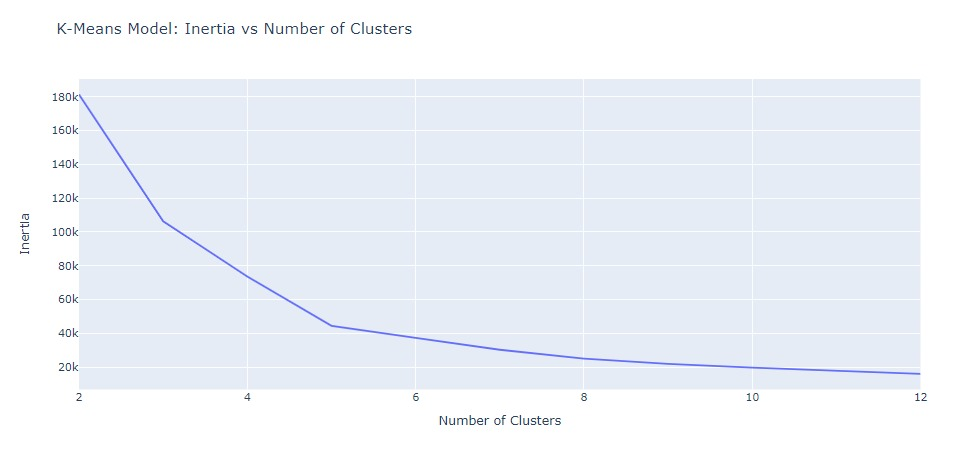
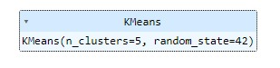

# Laporan Proyek Machine Learning
### Nama :Ariya Wibawa Pratama
### Nim :211351025
### Kelas :Pagi A

## Domain Proyek
Kumpulan data ini dibuat  untuk konsep segmentasi pelanggan, yang juga dikenal sebagai analisis keranjang pasar. Saya akan mendemonstrasikannya dengan menggunakan teknik ML tanpa pengawasan (KMeans Clustering Algorithm). 

## Business Understanding

### Problem Statements
- pemilik mall ingin memahami pelanggan seperti apa yang dapat dengan mudah dikumpulkan [Pelanggan Sasaran] 

### Goals
- tim pemasaran dapat memahaminya dan merencanakan strategi yang sesuai.
### Solution statements
- Membangun suatu sistem yang dapat mempelajari data mall customers untuk dilakukan clustering data.
- Sistem berjalan dengan menggunakan metode K Means yang dinilai cocok untuk melakukan clustering
## Data Understanding
Dataset yang digunakan berasal dari situs Kaggle. Dataset ini mengandung 200 entries dan 5 columns<br>

Mall Customer Segmentation Data (https://www.kaggle.com/datasets/vjchoudhary7/customer-segmentation-tutorial-in-python/data) .

Selanjutnya uraikanlah seluruh variabel atau fitur pada data. Sebagai contoh:  

### Variabel-variabel pada kanker paru-paru adalah sebagai berikut:
 - customer id
 - gender
 - age
 - Annual Income (k$)
 - Spending Score (1-100)
## Import Library yang dibutuhkan
```bash
import pandas as pd
import matplotlib.pyplot as plt
import seaborn as sns
import plotly.express as px
from sklearn.cluster import KMeans
from sklearn.metrics import silhouette_score
```
## Data Discovery
```bash
df = pd.read_csv('Mall_Customers.csv')
df
```
## Data Preparation
```bash
df.describe()
```
Lalu kita akan melihat informasi mengenai dataset dengan syntax seperti dibawah:
```bash
df.info()
```
```bash
mask = df['Spending Score (1-100)'] > 50
df_score = df[mask]
df_score
```
```bash
df_score.describe()
```
## EDA
Histogram
```bash
plt.figure(figsize = (15 , 6))
n = 0
for x in ['Age' , 'Annual Income (k$)' , 'Spending Score (1-100)']:
    n += 1
    plt.subplot(1 , 3 , n)
    plt.subplots_adjust(hspace =0.5 , wspace = 0.5)
    sns.histplot(df[x] , bins = 20)
    plt.title('Distplot of {}'.format(x))
plt.show();
```
 <br>
fitur-fitur ini karena memiliki sedikit kemiringan cenderung terdistribusi secara normal

```bash
df_score['Age'].hist()
plt.xlabel('Age')
plt.ylabel('Count')
plt.title('Spending Score(51 ~ 100): Age Distribution');
```
 <br>
Histogram kami menunjukkan bahwa banyak orang yang memiliki skor pengeluaran lebih dari 50 adalah orang-orang muda.

Hitung Plot Gender
```bash
plt.figure(figsize = (15 , 5))
sns.countplot(y = 'Gender' , data = df_score)
plt.title('Spending Score(51 ~ 100): Gender Distribution')
plt.show();
```
 <br>
```bash
plt.figure(figsize = (15 , 5))
sns.countplot(y = 'Gender' , data = df)
plt.title('Gender Distribution')
plt.show();
```
 <br>
Merencanakan Hubungan antara Usia, Pendapatan Tahunan dan Skor Pengeluaran
```bash
plt.figure(1 , figsize = (15 , 7))
n = 0
for x in ['Age' , 'Annual Income (k$)' , 'Spending Score (1-100)']:
    for y in ['Age' , 'Annual Income (k$)' , 'Spending Score (1-100)']:
        n += 1
        plt.subplot(3 , 3 , n)
        plt.subplots_adjust(hspace = 0.5 , wspace = 0.5)
        sns.regplot(x = x , y = y , data = df)
        plt.ylabel(y.split()[0]+' '+y.split()[1] if len(y.split()) > 1 else y )
plt.show()
```
 <br>
```bash
plt.figure(1 , figsize = (15 , 6))
for gender in ['Male' , 'Female']:
    plt.scatter(x = 'Age' , y = 'Annual Income (k$)' , data = df[df['Gender'] == gender] ,
                s = 200 , alpha = 0.5 , label = gender)
plt.xlabel('Age'), plt.ylabel('Annual Income (k$)')
plt.title('Age vs Annual Income w.r.t Gender')
plt.legend()
plt.show()
```
 <br>
```bash
plt.figure(1 , figsize = (15 , 6))
for gender in ['Male' , 'Female']:
    plt.scatter(x = 'Annual Income (k$)',y = 'Spending Score (1-100)' ,
                data = df[df['Gender'] == gender] ,s = 200 , alpha = 0.5 , label = gender)
plt.xlabel('Annual Income (k$)'), plt.ylabel('Spending Score (1-100)')
plt.title('Annual Income vs Spending Score w.r.t Gender')
plt.legend()
plt.show()
```
 <br>
```bash
plt.figure(1 , figsize = (15 , 7))
n = 0
for cols in ['Age' , 'Annual Income (k$)' , 'Spending Score (1-100)']:
    n += 1
    plt.subplot(1 , 3 , n)
    plt.subplots_adjust(hspace = 0.5 , wspace = 0.5)
    sns.violinplot(x = cols , y = 'Gender' , data = df , palette = 'vlag')
    sns.swarmplot(x = cols , y = 'Gender' , data = df)
    plt.ylabel('Gender' if n == 1 else '')
    plt.title('Boxplots & Swarmplots' if n == 2 else '')
plt.show()
```
 <br>
## Split
```bash
X = df.iloc[: , [3,4]]
print(f"X Shape {X.shape}")
X.head()
```
## modeling
Clustring Using K-Means
Iterate
Gunakan perulangan for untuk membangun dan melatih model K-Means dengan n_clusters berkisar dari 2 hingga 12 (inklusif). 
Setiap kali model dilatih, hitung inersianya dan tambahkan ke daftar inertia_errors, lalu hitung skor siluet dan tambahkan ke daftar siluet_scores.
Segmentasi menggunakan Skor Pendapatan dan Pengeluaran Tahunan
```bash
n_clusters = range(2 , 13)
inertia_errors = []
silhouette_scores = []
# Tambahkan loop `for` untuk melatih model dan menghitung inersia, skor siluet
for k in n_clusters:
    model = KMeans(n_clusters= k , random_state= 42)
    #TRAIN MODEL
    model.fit(X)
    #CALCULATE INERTIA
    inertia_errors.append(model.inertia_)
    #CALCULATE SILHOUETTE SCORE
    silhouette_scores.append(silhouette_score(X , model.labels_))
print("Inertia:", inertia_errors[:3])
print()
print("Silhouette Scores:", silhouette_scores[:3])
```
```bash
# Buat plot garis `inertia_errors` vs `n_clusters`
fig = px.line(x= range(2 , 13) , y= inertia_errors , title="K-Means Model: Inertia vs Number of Clusters")
fig.update_layout(xaxis_title="Number of Clusters" , yaxis_title="Inertia")
fig.show()
```
 <br>
```bash
# Buat plot garis `silhouette_scores` vs `n_clusters`
fig = px.line(x= n_clusters , y= silhouette_scores , title= "K-Means Model: Silhouette Score vs Number of Clusters")
fig.update_layout(xaxis_title= 'Number of Clusters' , yaxis_title= 'Silhouette Score')
fig.show();
```
 <br>
Jumlah cluster terbaik adalah 5
```bash
final_model = KMeans(n_clusters=5 , random_state= 42)
final_model.fit(X)
```
 <br>
```bash
labels = final_model.labels_
centroids = final_model.cluster_centers_
print(labels[:5])
```
[2 3 2 3 2]
```bash
#plot "Annual Income" vs "Spending Score" with final_model labels
sns.scatterplot(x=df['Annual Income (k$)'] , y= df['Spending Score (1-100)'] ,
               hue=labels,
               palette='deep')
sns.scatterplot(
    x= centroids[:,0],
    y= centroids[: ,1],
    color= 'gray',
    marker= '*',
    s= 500
)
plt.xlabel("Annual Income (k$)")
plt.ylabel("Spending Score (1-100)")
plt.title("Annual Income vs. Spending Score");
```
 <br>
```bash
# Buat diagram batang `xgb` berdampingan
xgb= X.groupby(final_model.labels_).mean()
fig = px.bar(
    xgb,
    barmode= 'group',
    title= "Annual income and spending score by Cluster"
)
fig.update_layout(xaxis_title= "Clusters" , yaxis_title= 'Value')

fig.show()
```
 <br>
## simpan model (Pickle)
```bash
iX.to_excel("output_cluster.xlsx")
```
